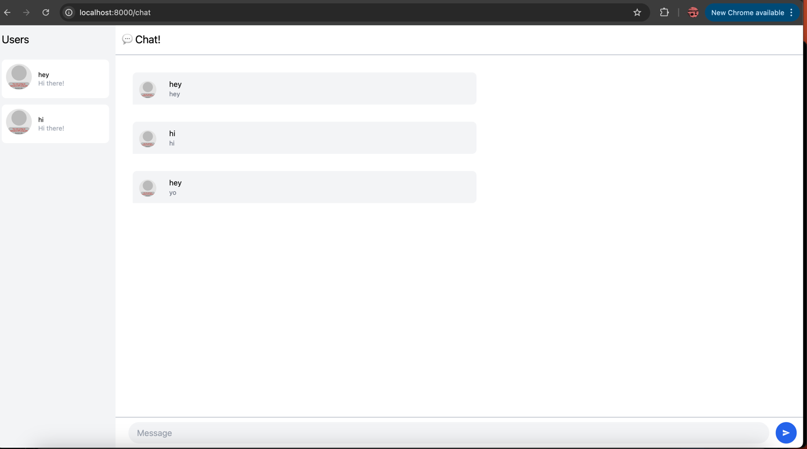

## 🎯 Experiment 3.1: Original code

As part of this experiment, I cloned and explored the original client and server code from the blog article. I followed the instructions to build and run the chat system on my local machine. Below is the screenshot I captured after successfully running the **original client-side chat application**:

### 📸 Screenshot
