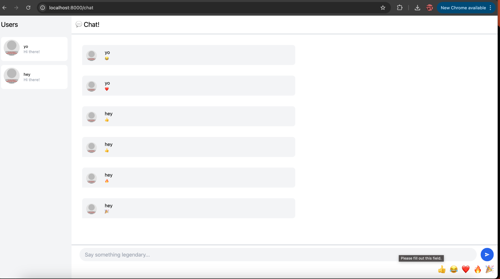

## 🎯 Experiment 3.1: Original code

As part of this experiment, I cloned and explored the original client and server code from the blog article. I followed the instructions to build and run the chat system on my local machine. Below is the screenshot I captured after successfully running the **original client-side chat application**:

### 📸 Screenshot

## 🧠 Experiment 3.2: Be Creative!

As part of this creativity exercise, I added an interactive emoji bar to the chat UI. Users can now click emoji reactions like 👍, 😂, ❤️, 🔥, and 🎉 — instantly sending them into the chat without typing. This adds a playful and expressive dimension to the chat interface.

### ✨ What I Did:

- 💬 **Emoji Bar**: Added clickable emoji buttons under the message input.
- 🎨 **Animated Interactions**: Buttons scale slightly when hovered to feel tactile and responsive.
- 🎯 **Functional Integration**: Emoji presses send them as chat messages via WebSocket, just like typed input.
- 💡 **UX Enhancement**: I also updated the placeholder with friendly text — "Say something legendary..."

### 📸 Screenshot

